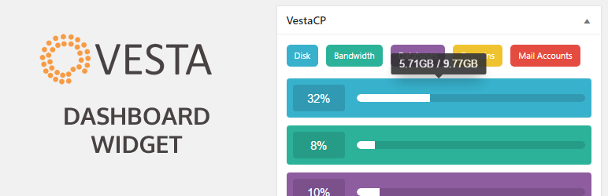
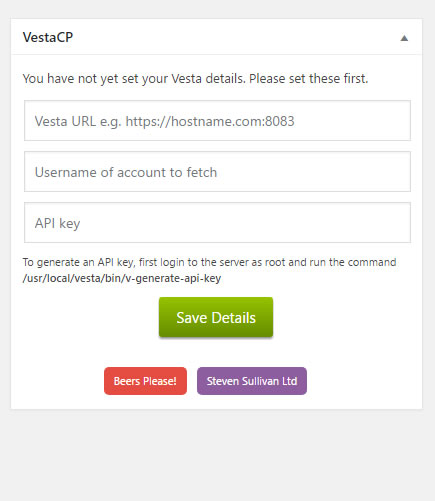
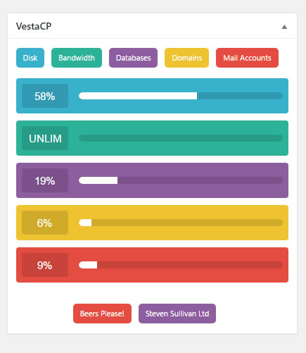

# VestaCP Dashboard Widget for WordPress

Adds a widget to the Dashboard showing your VestaCP accounts details. Requires an API key from VestaCP.

Latest release will always be in the WordPress Repo: https://wordpress.org/plugins/vestacp-dashboard-widget/

A simple plugin that shows the following stats from your VestaCP account:

* Disk Usage
* Bandwidth Usage
* Database Usage
* Web Domain Usage
* Mail Account Usage

To generate an API key, first login to the server as root and run the command:

`/usr/local/vesta/bin/v-generate-api-key`

# Installation

Use the automatic installer via WordPress or download the plugin and:

1. Upload the plugin files to the `/wp-content/plugins/vestacp-dashboard-widget` directory
1. Activate the plugin through the 'Plugins' screen in WordPress
1. View the Dashboard to configure the settings.

# Screenshots

